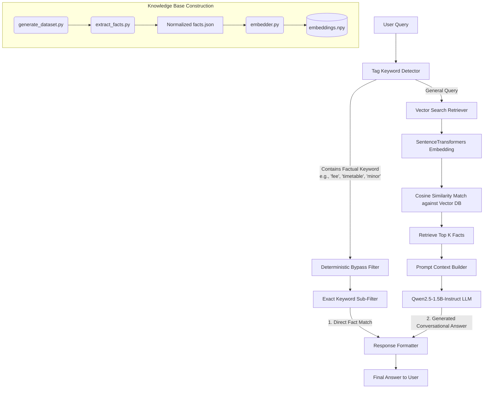
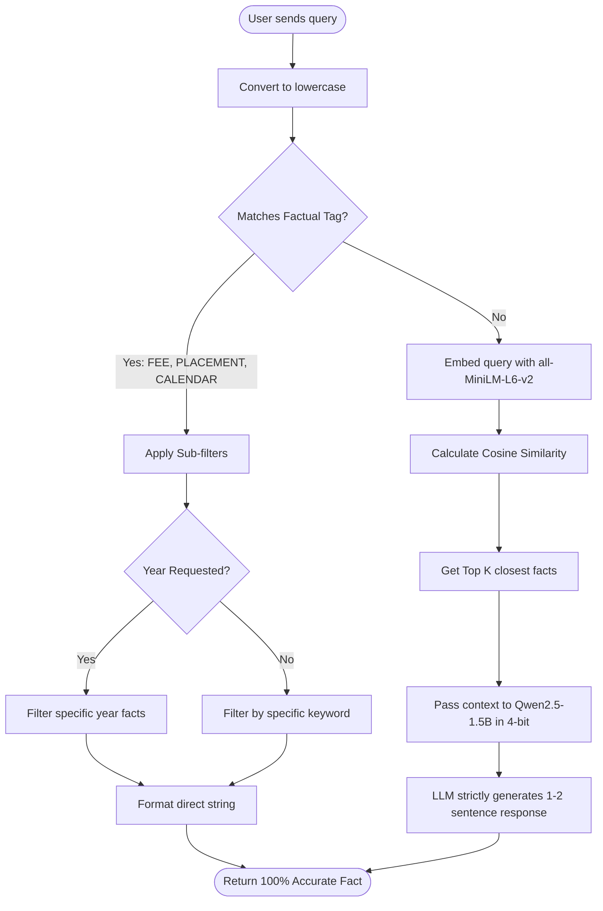

# KLE Tech University Chatbot (Hybrid Semantic RAG)

A highly accurate, custom chatbot designed for **KLE Technological University**. This bot uses a **Hybrid Retrieval-Augmented Generation (RAG)** architecture that guarantees 100% factual accuracy for structured data (like fees and timetables) while utilizing the **Qwen2.5-1.5B-Instruct** large language model for conversational interactions.

---

## 🏗️ System Architecture

Unlike traditional SLM chatbots that are prone to hallucinating numbers and dates, this system uses a **Bypass Architecture**. Factual queries are intercepted and handled deterministically, while general queries are routed through a vector-search RAG pipeline to the Qwen LLM.

### Block Diagram



### Flowchart: Query Lifecycle



---

## 🛠️ Technical Implementation Details

| Component              | Technology                          | Purpose                                                   |
|------------------------|-------------------------------------|-----------------------------------------------------------|
| **Embedding Engine**   | `SentenceTransformer` (all-MiniLM)  | Converts university facts into high-dimensional vector space|
| **Vector Database**    | NumPy (`embeddings.npy`)            | Lightweight, disk-cached similarity search pool           |
| **Language Model**     | `Qwen/Qwen2.5-1.5B-Instruct`        | Handles greetings and non-strict conversational responses |
| **Quantization**       | `BitsAndBytes` (NF4, 4-bit)         | Allows the 1.5B model to run comfortably on a laptop GPU  |
| **Retrieval System**   | Cosine Similarity + Regex bypassing | Prevents Hallucinations for structured data requests      |

---

## 🚀 Key Features

- **Zero-Hallucination Bypass:** Uses explicit tagging (`[FEE]`, `[PLACEMENT]`, `[CALENDAR]`) to intercept queries and bypass the LLM entirely, guaranteeing correct numerical data.
- **Year-Isolation Filtering:** Employs strict Regex rules to ensure 2023 placement queries don't accidentally "steal" data from 2024 results.
- **Dynamic Semester Detection:** Automatically detects available semesters (e.g., 4th and 6th) directly from the knowledge base without hardcoding.
- **University Intelligence:** Pre-loaded with comprehensive data including:
  - Placement records (highest packages, top recruiters, officer details).
  - Full Academic Calendar (Even Semester 2025-26, Minor Exams, Pleiades, Registration).
  - Weekly Master Timetables and ESA exam dates.
- **Locally Hosted RAG:** The generative AI runs locally on the GPU using `transformers`, ensuring complete privacy.

---

## 📁 Project Structure

| File                    | Description                                              |
|-------------------------|----------------------------------------------------------|
| `chat.py`               | Main interactive CLI, inference engine, and LLM loader   |
| `generate_dataset.py`   | Raw source dictionary of all university knowledge        |
| `extract_facts.py`      | Normalizes the dataset into raw factual strings          |
| `embedder.py`           | Converts the facts into NumPy vector embeddings          |
| `facts.json`            | The normalized knowledge base text strings               |
| `embeddings.npy`        | The pre-computed vector space file                       |

---

## 📖 How to Update Knowledge & Run

If you want to add new timetables or holidays to the bot, follow this process:

### 1. Update the Raw Data
Add new dates or facts to `generate_dataset.py`.

### 2. Extract & Normalize Facts
Run the extraction script to build a clean JSON array of facts.
```bash
python scratch/extract_facts.py
```

### 3. Rebuild the Vector Embeddings
Compute the new semantic vectors so the bot can understand them.
```bash
python embedder.py
```

### 4. Chat with the Bot
Launch the standard CLI interface.
```bash
python chat.py
```
